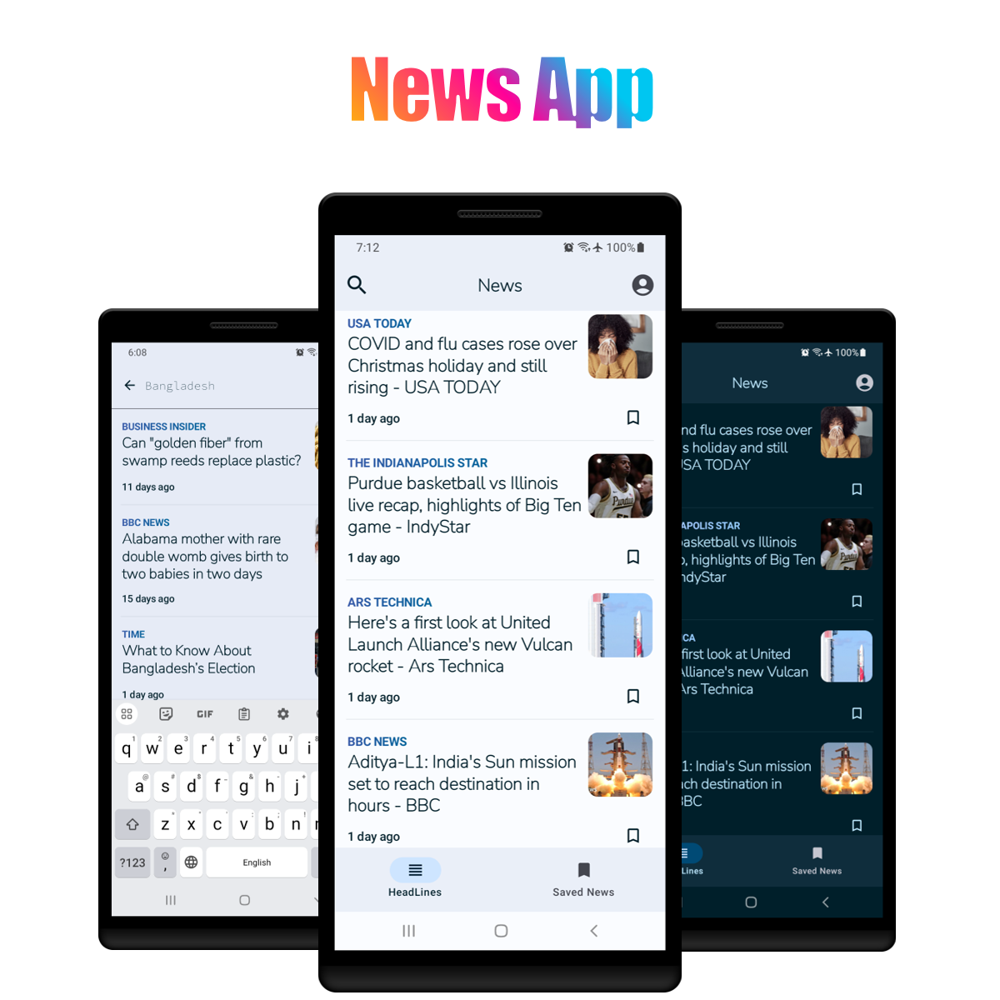

# **News App**

**Stay informed with the latest news, right at your fingertips!**

This Android app provides a seamless way to browse, search, and bookmark news articles from various sources, ensuring you're always up-to-date on the latest happenings.

**Key Features:**

- **Explore the Latest News:** Discover the most recent news articles from a variety of sources, presented in a clear and engaging format.
- **Search for Specific Topics:** Easily find news articles that align with your interests by using the integrated search functionality.
- **Bookmark Articles for Later:** Save articles that you want to read later or revisit for reference, creating a personalized news library.
- **Clean and Intuitive Interface:** Navigate the app effortlessly with a user-friendly interface that prioritizes readability and ease of use.
- **Seamless Pagination:** Enjoys a smooth scrolling experience as news articles are loaded efficiently in smaller chunks using Paging 3.
- **Offline Access:** Access bookmarked and previously loaded headlines even without an internet connection, ensuring continuous access to information.

**Built with Modern Technologies:**

- **Jetpack Compose:** Leverages the power of Jetpack Compose to create a visually appealing and responsive UI, crafted entirely with code.
- **Kotlin:** Embraces Kotlin's conciseness and expressiveness for efficient and maintainable code.
- **Hilt:** Manages dependency injection effectively, ensuring a well-structured and testable codebase.
- **Room:** Persists bookmarked articles locally for offline access and smooth retrieval.
- **Retrofit:** Fetches news data from APIs seamlessly, integrating seamlessly with Kotlin's serialization capabilities.
- **Paging 3:** Handles efficient pagination of news articles, providing a smooth user experience even with large datasets.
- **Coil:** Loads images efficiently, optimizing performance and visual appeal.

**Ready to stay informed? [Download the app and dive into the world of news!](./albin-news.apk)**

**Additional Information:**

- **Target SDK:** 34
- **Minimum SDK:** 28 ("Pie"; Android 9.0)
- **Language:** Kotlin
- **Architecture:** MVVM